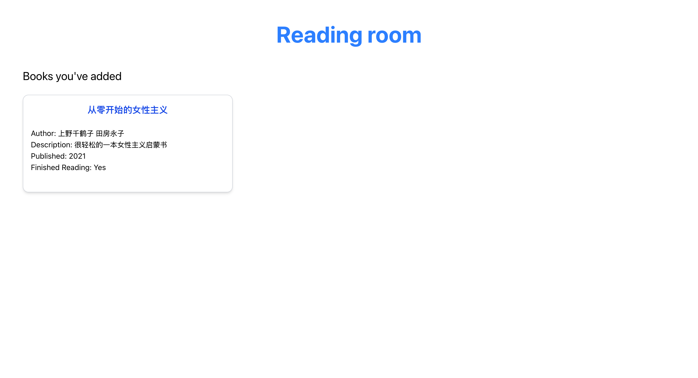

# my-bookshelf

This is an app used to store books I have read and my comments.
This one-page application used tailwind css + react as frontend and fastAPI as backend.

## Application structure

if you are interested in how the code build up to this application or thinking of
adapting this application , you should check out these files. They all contain
comments here and there to explain themselves :)

- my-bookshelf 
    -- my-bookshelf-backend 
        --- app 
            ---- main.py
            ---- models.py

    -- my-bookshelf-frontend
        --- src
            ---- App.js
            ---- index.js
            ---- tailwind.css
            ---- tailwindoutput.css
    

## Set development environment
to activate virtual environment:
1. python -m venv venv 
2. source venv/bin/activate

to run front end - react:
1. go to 'my-bookshelf-frontend' folder
2. npm start

to run front end - react with tailwind (if not run with tailwind, when you write
tailwind code, the page won't update itself):
1. go to 'my-bookshelf-frontend' folder
2. npx tailwindcss -i ./src/tailwind.css -o ./src/tailwindoutput.css --watch

to run back end - fastAPI:
1. go to 'my-bookshelf-backend'/'app' folder
2. uvicorn main:app --reload

## What the running app looks like:

## What did I do to combine tailwind with frontend framework:
With reference to: https://tailwindcss.com/docs/installation/tailwind-cli
first, cd to frontend folder
then, enter following commands: 
1. npm install tailwindcss @tailwindcss/cli
2. create a new file call tailwind.css inside my-bookshelf-frontend/src folder
3. enter below command, it should create a tailwindoutput.css file inside my-bookshelf-frontend/src
   
    This command tells Tailwind to:
   
        Take tailwind.css as the input
   
        Generate tailwindoutput.css as the compiled file
   
        Recompile on file changes (--watch)

    npx tailwindcss -i ./src/tailwind.css -o ./src/tailwindoutput.css --watch

5. add this line of code to my-bookshelf-frontend/src/App.js
   
        import './tailwindoutput.css';
   
    add these codes to my-bookshelf-frontend/src/tailwind.css
   
        @import "tailwindcss";
        @tailwind base;
        @tailwind components;
        @tailwind utilities;
   
    add this to my-bookshelf-frontend/public/index.html
   
        <head>
            ...
            <link href="./tailwindoutput.css" ref="stylesheet"/>
            ...
        </head>
   

7. ready to change our style, note that these changes need to be made while step3's command
   is running so that new tailwind code is automatically recompiled.
   
   An example change can be done inside my-bookshelf-frontend/src/App.js:
   
   h1 class="text-3xl font-bold text-center text-red-500"
   

## Declaration:

I acknowledge the use of **ChatGPT** and **DeepSeek** to help me develop this application.
I entered the following prompts: 

    - how to make use of this backend function in my react frontend? with insert code
    
    - what does this do: npx @tailwindcss/cli -i ./src/input.css -o ./src/output.css --watch
    

## Bugs encountered & Solutions:
    bug 1 : sh: react-scripts: command not found
    solution: npm install --save react react-dom react-scripts
    solution reference: https://stackoverflow.com/questions/40546231/sh-react-scripts-command-not-found-after-running-npm-start

    bug 2 : tailwind style not showing
    solution: checkout tailwindoutput.css file, if it didn't contain the style definition
          then it means you didn't import basic tailwind style correctly
          fix this by include this in my-bookshelf-frontend/src/tailwind.css: 
          @import "tailwindcss";
